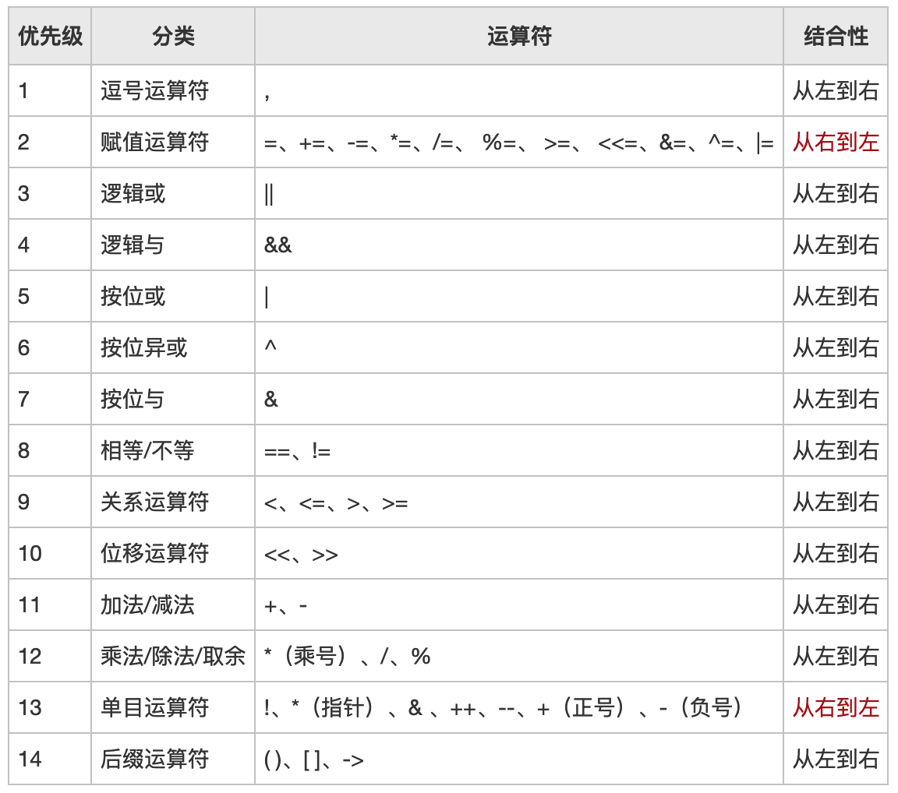

# Go语言程序元素

Go语言有5种符号，分别是标识符（identifier）、关键字（keyword）、字面量（literal）、分隔符（delimiter）与运算符（operator）。这些是组成Go语言代码和程序的最基本单位。


## 标识符

Go语言标识符是用于标识变量、函数或者是任何自定义项目的名称（即程序实体）。

标识符有两种类型，

一种是预定义标识符，在Go语言源代码中声明。例如，

数据类型：bool、byte、float32、float64、int、int8、int16、int32、int64、uint、uint8、uint16、uint32、uint64、uintptr、string；

内建函数名：append、cap、len、close、complex、copy、delete、imag、make、new、panic、print、println、real、recover;

其它标识符：iota、nil、_。

最后一个 “\_” 是空标识符，一般用在变量声明与包的导入中。
Go语言中，如果存在一个变量或包没有使用到，那么编译报错。如果把变量或包赋给 “\_”，也就不会报错了。实际上并没有对变量进行任何操作，程序初始化后空标识符就会被释放。

另一种标识符是自定义的标识符，作为程序实体的存在。一般来说，同一个代码块中不允许程序实体同名。使用不同代码包中的实体需要使用包标识符声明。


## 关键字

Go语言的关键字一共有25个：

包导入与声明：import、package

程序实体声明与定义：var、type、func、interface、map、struct、chan、const

流程控制：if、else、continue、break、for、range、return、go、goto、switch、case、default、fallthrough、select、defer

关键字，也称为保留字，这些保留字不能用作常量、变量或任何其它标识符名称。


## 字面量

字面量是表示值的一种标记法，在Go语言中，字面量的含义要更广一些：

1）用于表示基础数据类型值的各种字面量

2）用于表示用户构造的自定义复合数据类型的类型字面量

3）用于表示复合数据类型的值的复合字面量

例：
```go
const b int = 10                // b为常量，10为字面量
var str string = "hello world"  // str为变量，hello world为字面量
```


## 分隔符

分隔符，用于分隔其它元素的符号。

例如：
```text
fmt.Println("hello, world!")

包含了6个标记，也就是3个分隔符：
fmt
.
Println
(
"hello, world!"
)
```
括号分隔符包括 括号、中括号和大括号；标点分隔符包括 小数点、逗号、分号、冒号和省略号

注意：Go语言不需要以分号“;”结尾，这些工作由Go语言编译器自动完成。如果将多个语句写在同一行，就必须使用 “分号” 分隔，在实际开发中不鼓励这种写法。


## 运算符

运算符是用来执行运算或逻辑操作的符号。

同其它编程语言一样。其运算优先级也与其它编程语言一致。



如上图所示，优先级值越大，表示优先级越高

此外，Go语言不支持运算符重载。
