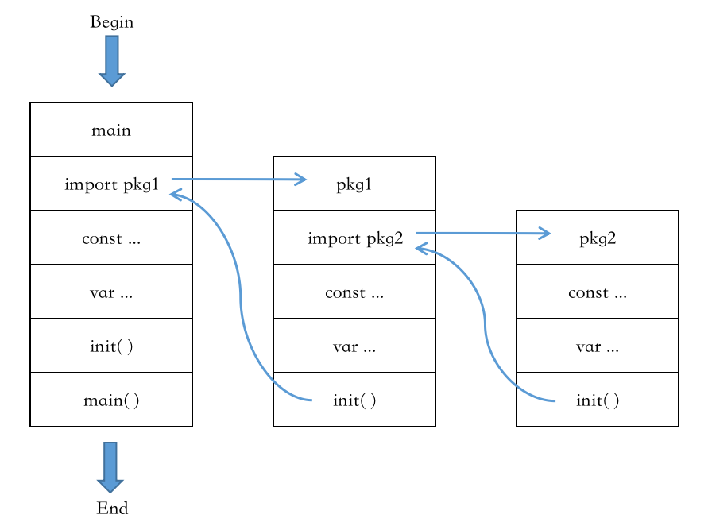

# 包

Go语言的源码复用建立在包（package）基础之上，Go语言的入口 main() 函数所在的包（package）叫做 main，main 包想要引用别的代码，必须以包的方式进行引用。

包的三个特性：

* 显式声明：所有导入的包必须在每个文件的开头显式声明，这样编译器就没有必要读取和分析整个源文件来判断包的依赖关系。

* 无环依赖：禁止包的环状依赖，因为没有循环依赖，包的依赖关系形成一个有向无环图，每个包可以被独立编译，而且很可能是被并发编译。

* 无须遍历：编译包后的目标文件不仅记录包本身的导出信息，同时还记录了包的依赖关系。因此，在编译一个包的时候，编译器只需要读取每个直接导入包的目标文件，而不需要遍历所有依赖的文件，毕竟很多都是重复的间接依赖。


Go语言包的初始化有如下特点：

* 包初始化程序从main函数引用的包开始，逐级查找包的引用，直到找到没有引用其它包的包，最终形成一个有向无环图。

* Go编译器会将有向无环图转换为一棵树，然后从树的叶子节点开始逐层向上对包进行初始化。

* 单个包的初始化如下图所示，先初始化常量，然后是全局变量，最后执行包的init函数。





使用包成员之前先要导入包，如下为几种导入包的方式：
```go
import "crypto/rand"    // 默认模式：rand.Function
import R "crypto/rand"  // 包重命名：R.Function
import . "crypto/rand"  // 简便模式：Function
import _ "crypto/rand"  // 匿名导入：仅让该包执行初始化函数

// 另一种写法：
import (
    "crypto/rand"
    mrand "math/rand"   // 包重命名
)
```

注意：

1） Go语言不允许导入包却不使用，如果导入的包并未使用，在编译时会被视为错误（不包括"import \_"）。

2） 包的重命名不仅可以用于解决包名冲突，还可以解决包名过长、避免与变量或常量名称冲突等情况。

示例：
```go
package main

import (
    "fmt"
    "image"
    "image/jpeg"
    _ "image/png"
    "io"
    "os"
)

func main() {
    if err := toJPEG(os.Stdin, os.Stdout); err != nil {
        fmt.Fprintf(os.Stderr, "jpeg:%v\n", err)
        os.Exit(1)
    }
}

func toJPEG(in io.Reader, out io.Writer) error {
    img, kind, err := image.Decode(in)
    if err != nil {
        return err
    }
    fmt.Fprintln(os.Stderr, "Input format = ", kind)
    return jpeg.Encode(out, img, &jpeg.Options{Quality: 95})
}
```

