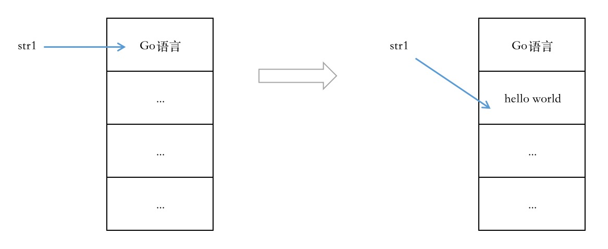

# 基础数据类型

数据类型用于声明函数与变量、常量的数据类型。数据类型是为了提高内存的使用效率，不同数据在内存中存储所需要的空间大小是不一样的。在编程开发时指定数据类型，系统根据这些类型来开辟合适大小的空间，这可以充分利用内存空间。


## 整型

Go语言一共有9种不同大小的整型，无符号4种（uint8、uint16、uint32、uint64），有符号4种（int8、int16、int32、int64），还有一种uintptr类型（主要用于底层编程）。Go语言可以根据不同平台对int做出调整，既可以是int32，也可以是int64，uint同理。

```go
package main

import "fmt"

var x int32
var y int64

func main() {
    x, y = 2, 4
    if x == y {     // 编译不通过，不同类型不能进行比较
        fmt.Println("x等于y")
    }
    
    if x == 2 || y == 2 {   // 编译通过
        fmt.Println("x等于y")
    }
    
    if x == 9999999999 {    // 编译不通过，因为9999999999超过int32的范围，不能进行比较
        fmt.Println("x等于9999999999")
    }
}
```


## 浮点型

浮点型，用来表示包含小数点的数据，Go语言提供了两种精度的浮点数：float32和float64，在Go语言中没有float这种类型。float32精确到小数点后7位，float64精确到小数点后15位。

!!! note ""
    注意：标准库中math包的所有有关数学运算的函数都要求接收float64这个类型，所以尽可能使用float64，省去后续的类型转换步骤。

示例1：
```go
package main

import (
    "fmt"
    "reflect"
)

func main() {
    var a float64
    a = 1       // 不管是否有小数点，a都是浮点型
    b := 2      // 如果没有小数点，b会被推导为整型
    c := 3.0    // 如果有小数点，c会被推导为浮点型
    
    //x := a + b    // 编译失败，不同类型不允许运算
    x := a + c
    fmt.Println(a, b, c, x)
    fmt.Println("a的类型是：", reflect.TypeOf(a))
    fmt.Println("b的类型是：", reflect.TypeOf(b))
    fmt.Println("c的类型是：", reflect.TypeOf(c))
    fmt.Println("x的类型是：", reflect.TypeOf(x))
}
```

示例2：
```go
package main

import "fmt"

func main() {
    var a float64
    a = 1
    b := 1.0000000000000000001
    c := 1.00000000000001
    if a == b {
        fmt.Println("a等于b")
    } else {
        fmt.Println("a不等于b")
    }
    
    if a == c {
        fmt.Println("a等于c")
    } else {
        fmt.Println("a不等于c")
    }
}
```

浮点型数据精度不同会导致比较结果与预期不一致。如上面代码中，a和b显然不相等，但是因为精度限制在小数点后15位，之后的数字会被舍弃，所以程序返回相等的结果。


## 复数

复数是由两个浮点数表示的，如a+bi。其中 a 称为实部，b 称为虚部，i 称为虚数单位。Go语言的复数类型有两种，分别是 complex64 和 complex128 。

```go
package main

import "fmt"

func main() {
    var a complex64         // 由两个float32构成的复数类型
    a = 3.2 + 12i
    
    b := 3.2 + 12i          // 隐式声明，默认是complex128
    c := complex(3.2, 12)   // 定义并赋值，c的数值等于b
    d := b + c              // 复数运算
    fmt.Println(a, b, c, d)
    
    ar := real(a)       // 获取实部
    ai := imag(a)       // 获取虚部
    fmt.Println(ar, ai)
}
```


## 字符串

Go语言中，一个字符串是不可改变的字符序列，一个ASCII码占用1个字节，其它字符需要占用2～4个字节。Go语言的作者是当前搞出UTF-8编码格式的那几个人，所以Go语言默认以UTF-8编码格式进行存储。

```go
package main

import "fmt"

func main() {
    var str1 string = "Go语言"
    fmt.Println(str1)
    
    str1 = "hello world"
    fmt.Println(str1)
}
```
第一条语句创建了一个内容为"Go语言"的字符串，并将其引用赋值给str1。后面一条语句创建了一个内容为"hello world"的新字符串，并将其引用赋值给str1。
赋值后，第一个字符串仍然存在，但是不能访问它，因为变量现在指向了新的地址。



### 操作字符串

```go
package main

import "fmt"

func main() {
    read()
    join()
    compare()
    traversal()
    modify()
}

// 读取字符串：按照数组下标来读取。len() - 获取字符串长度，
func read() {
    str := "abc 你"
    for i:=0; i < len(str); i++ {
        fmt.Println(str[i])
    }
}

// 连接字符串：使用“+”符号连接字符串
func join() {
    str := "abc 你"
    fmt.Println(str[4:] + "好")
    
    str = "你好，" + "Go语言"
    fmt.Println(str)
}

// 比较：字符串比较是根据第一个字节来判定的
func compare() {
    str := "你"
    tmp := "好"
    if str < tmp {
        fmt.Println(str[0], tmp[0])
        fmt.Println(str[1], tmp[1])
        fmt.Println(str[2], tmp[2])
    }
    a := "a"
    b := "b"
    if a < b {
        fmt.Println(a[0], "小于", b[0])
    }
}

// 字符串遍历：for、for-range
func traversal() {
    str := "php是世界上最好的语言"
    for i:=0; i < len(str); i++ {
        fmt.Printf("%c", str[i])
    }
    fmt.Printf("\n")
    
    for _, v := range str {
        fmt.Printf("%c", v)
    }
}

// 字符串修改：
func modify() {
    str := "Hello Go"
    fmt.Println(str)
    str = "Go语言很强大"
    fmt.Println(str)
    
    /* 编译报错，无法修改其内的值 */
    //str[0] = 96
   
   b := []byte(str)
   b[0] = 97
   fmt.Println(str)     // str不能被修改，内容保持不变
   fmt.Printf("%s", b)  // 修改后的数据
}
```


## 布尔型

真或假，布尔型的值只可以是true或者false。布尔类型无法被其它类型赋值，也不支持类型转换。

```go
package main

import "fmt"

func main() {
    var b bool
    b = (1 != 0)
    odd := (10%2==1)
    fmt.Println(b, odd)
}
```
