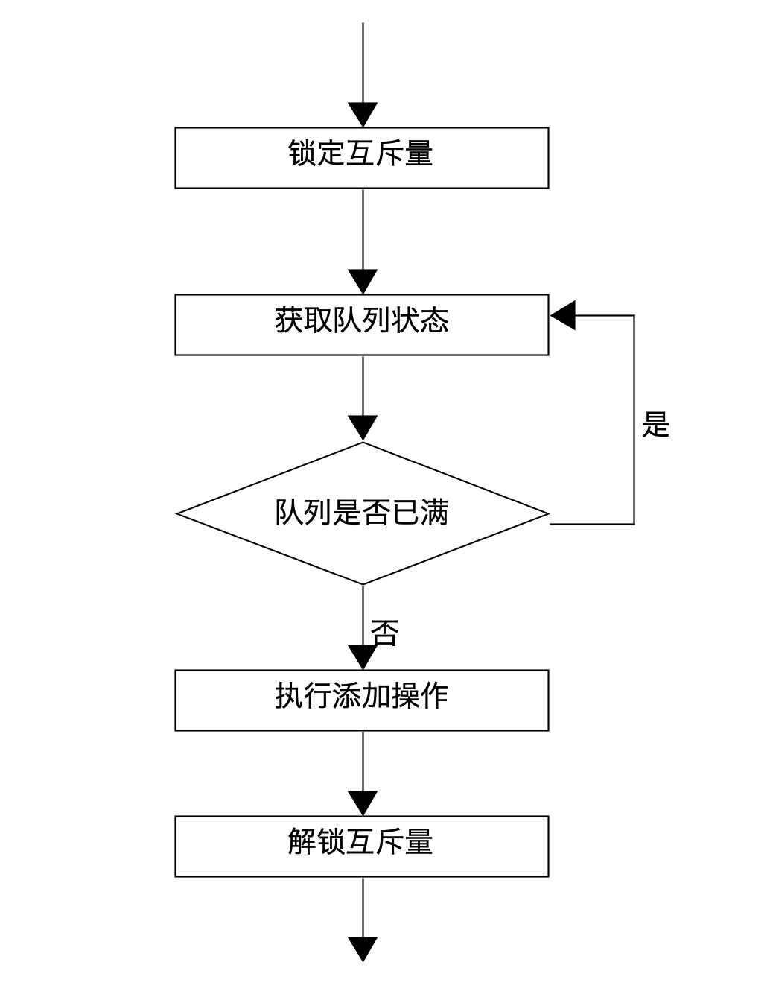
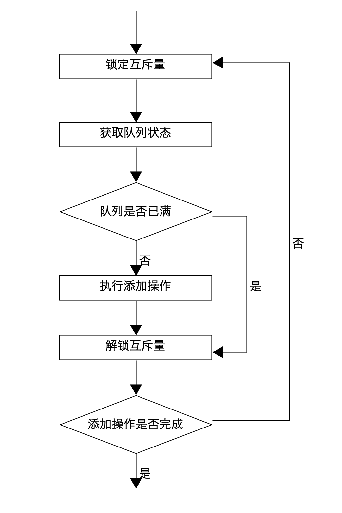
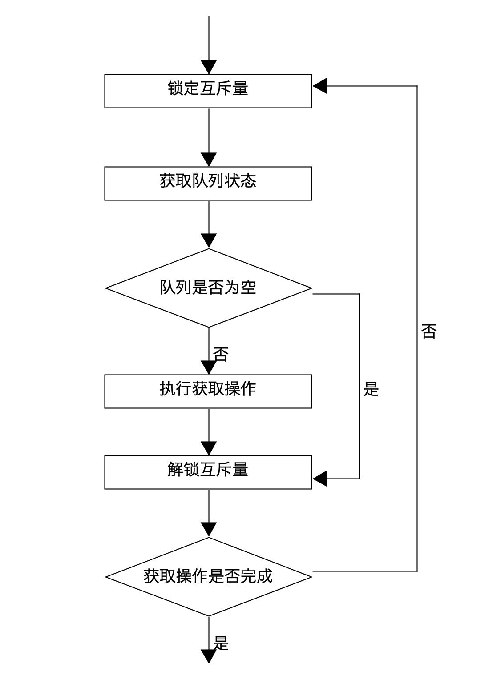
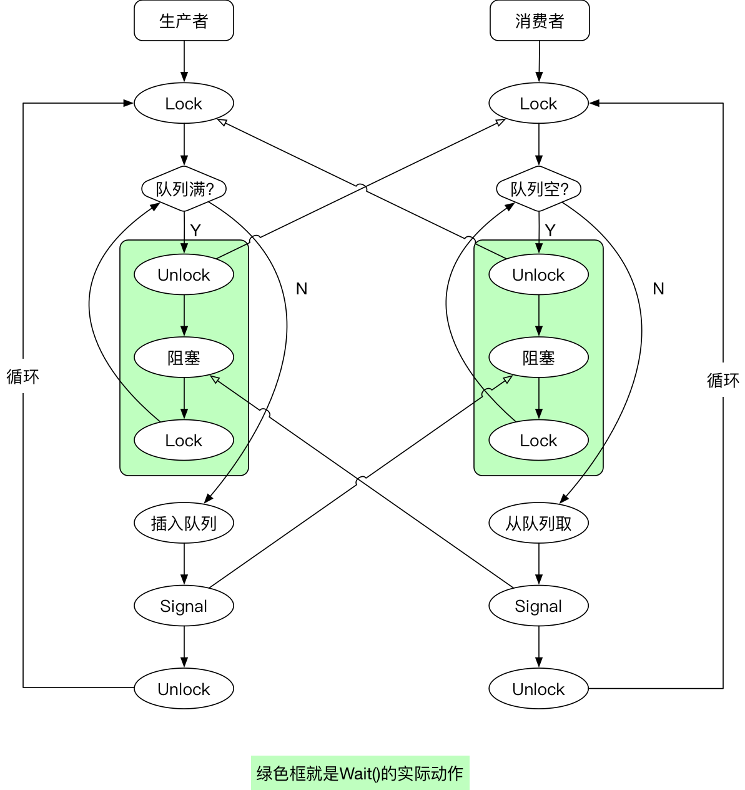

# 条件变量


## 用途

与互斥量不同，条件变量的作用并不是保证在同一时刻仅有一个线程访问某一个共享数据，而是在对应的共享数据的状态发生变化时，通知其它因此而被阻塞的线程。条件变量总是与互斥量组合使用。互斥量为共享数据的访问提供互斥支持，而条件变量可以就共享数据的状态的变化向相关线程发出通知。


## 声明

```text
lock := new(sync.Mutex)
cond := sync.NewCond(lock)
```

也可以写在一行：
```text
cond := sync.NewCond(new(sync.Mutex))
```


## 方法

对应的有3个常用方法：Wait，Signal，Broadcast

* func (c *Cond) Wait()
该函数的作用有如下三点：
    1) 阻塞等待条件变量满足
    2) 释放已掌握的互斥锁相当于cond.L.Unlock()。 注意：两步为一个原子操作。
    3) 当被唤醒，Wait()函数返回时，解除阻塞并重新获取互斥锁。相当于cond.L.Lock()

* func (c *Cond) Signal()
单发通知，给一个正等待（阻塞）在该条件变量上的goroutine（线程）发送通知。

* func (c *Cond) Broadcast()
广播通知，给正在等待（阻塞）在该条件变量上的所有goroutine（线程）发送通知。


## 工作原理

没用条件变量时候:



图1：生产者线程添加数据库的流程

图1存在一个问题：当队列总是满的时候，就会不停的循环获取队列状态，因此也不会释放锁，而消费者就无法获得锁来取走队列中的数据。如果队列中的数据无法取走，那么队列就永远都是满的，导致了死锁。


使用了条件变量后，解决了这个问题：



图2：生产者线程添加数据库的流程

图2解决了图1的问题：当队列满的时候，则先解锁，这样就不会死锁（释放锁给其他人用）




图3：消费者线程




抢占锁后，判断自己是否满足处理 ***条件***，如果不满足则先 ***释放锁给别人用***，然后自己 ***阻塞***，等别人主动 ***通知自己***(肯定是别人的事情做完了才会通知自己)，就解除阻塞，然后再去 ***获得锁***


## 代码示例

示例一：

```go
package main

import (
    "sync"
    "runtime"
    "math/rand"
    "time"
    "fmt"
)

// 使用channl实现消费者生产者模型。
func producer(out chan<- int, cond *sync.Cond)  {
    for {
        cond.L.Lock()
        for len(out) == 5 {
            cond.Wait()
        }
        num := rand.Intn(500)
        out <- num
        fmt.Println("--生产数据：", num)
        time.Sleep(time.Millisecond * 100)
        
        cond.L.Unlock()
        cond.Signal()
    }
}

func consumer(in <-chan int, cond *sync.Cond)  {
	for {
        cond.L.Lock()
        if len(in) == 0 {
            cond.Wait()
        }
        num := <- in
        fmt.Println("消费数据：",num)
        time.Sleep(time.Millisecond * 200)
        cond.L.Unlock()
        cond.Signal()
    }
}

func main()  {
    rand.Seed(time.Now().UnixNano())
    // 创建带缓冲channel
    ch := make(chan int, 5)

    cond := new(sync.Cond)
    cond.L = new(sync.Mutex)

    for i := 0; i < 5; i++ {
        go producer(ch, cond)
    }
    for i := 0; i < 5; i++ {
        go consumer(ch, cond)
    }

    for true {
        runtime.GC()
    }
}
```
输出：
```text
--生产数据： 287
--生产数据： 225
--生产数据： 280
--生产数据： 360
--生产数据： 95
消费数据： 287
消费数据： 225
消费数据： 280
消费数据： 360
消费数据： 95
--生产数据： 60
--生产数据： 306
--生产数据： 186
--生产数据： 445
消费数据： 60
--生产数据： 7
消费数据： 306
消费数据： 186
消费数据： 445
消费数据： 7
...
```


示例二：

```go
package main

import (
	"fmt"
	"time"
)

func main() {
	ch := make(chan int, 3)
	v := 0

	// Consumer
	go func() {
		for {
			fmt.Printf("Consumer: %d\n", <-ch)
		}
	}()

	// Producer
	for {
		v++
		fmt.Printf("Producer: %d\n", v)
		ch <- v
		time.Sleep(time.Second)
	}
}
```
输出：
```text
Producer: 1
Consumer: 1
Producer: 2
Consumer: 2
Producer: 3
Consumer: 3
Producer: 4
Consumer: 4
Producer: 5
Consumer: 5
```