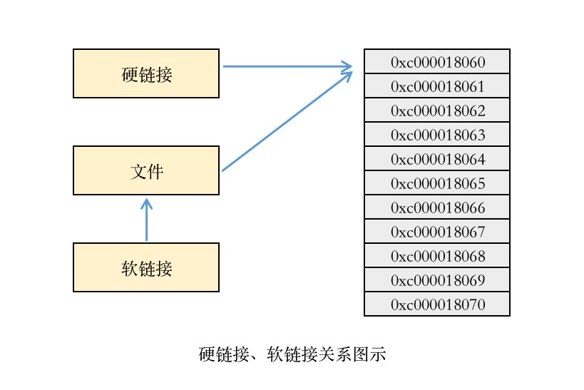

# 文件链接

Linux 系统中经常会碰到硬链接或者软链接之类的文件，一个普通文件实际上是指向了硬盘的一个inode地址。有点指针的意思。。。

硬链接会创建一个新的指针并且指向同一个地方，硬链接会保持与原文件双向同步，其中一个文件改动另一个文件也会跟着改动，相互影响。
当所有的链接被删除后，文件才会被删除。移动、重命名都不会影响硬链接。

软链接和硬链接不一样，软链接不直接指向硬盘中的相同地方，而是通过名字引用其它文件，由其它文件指向系统硬盘中的真正文件。




示例：

```go
package main

import (
	"fmt"
	"os"
)

func echoFileInfo(name string) {
	fileInfo, err := os.Lstat(name)
	if err != nil {
		fmt.Println(err)
	} else {
		fmt.Println(name, "链接文件信息：", fileInfo)
	}
}

func main() {
	filePath := "example.txt"

	// 输出文件信息
	echoFileInfo(filePath)

	// 创建一个硬链接
	hardLink := filePath + ".hl"
	err := os.Link(filePath, hardLink)
	if err != nil {
		fmt.Println(err)
	} else {
		fmt.Println("创建硬链接成功")
	}

	// 输出链接文件信息
	echoFileInfo(hardLink)

	// 创建一个软链接
	softLink := filePath + ".sl"
	err = os.Symlink(filePath, softLink)
	if err != nil {
		fmt.Println(err)
	} else {
		fmt.Println("创建软链接成功")
	}

	// 输出链接文件信息
	echoFileInfo(softLink)
}
```
输出：
```text
example.txt 链接文件信息： &{example.txt 45 511 {276498705 63723994572 0x1179780} {16777220 33279 1 12453878 501 20 0 [0 0 0 0] {1588403577 934662763} {1588397772 276498705} {1588403737 289417779} {1588672673976} 45 8 4096 0 0 0 [0 0]}}
创建硬链接成功
example.txt.hl 链接文件信息： &{example.txt.hl 45 511 {276498705 63723994572 0x1179780} {16777220 33279 2 12453878 501 20 0 [0 0 0 0] {1588403577 934662763} {1588397772 276498705} {1588403739 823765640}93181 672673976} 45 8 4096 0 0 0 [0 0]}}
创建软链接成功
example.txt.sl 链接文件信息： &{example.txt.sl 11 134218221 {823849754 63724000539 0x1179780} {16777220 41453 1 12466371 501 20 0 [0 0 0 0] {1588403739 823849754} {1588403739 823849754} {1588403739 8238{1588403739 823849754} 11 0 4096 0 0 0 [0 0]}}
```

!!! note ""
    由上面的链接文件信息可以看出，硬链接会直接影响到原始文件，因为都是指向同一个硬盘地址。而软链接不一定会影响原始文件。
