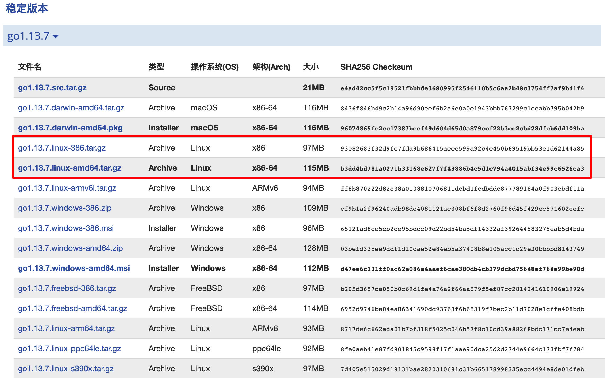

# 在Linux平台安装

1） 安装包可以在 [golang官网](https://goland.org/dl) 下载。(如果打不开，使用 [Go语言中文网](https://studygolang.com/dl) 进行下载)


2） 找到合适的包，复制Go语言开发包的下载链接（如：https://studygolang.com/dl/golang/go1.13.7.linux-amd64.tar.gz）



3） 在终端使用 cd 命令进入你用来存放安装包的目录中（这里使用的是 /usr/local/ 目录，我们也可以使用其它目录），方便为宜。

```shell
root@centos:~# cd /usr/local/
root@centos:/usr/local#
```

4） 使用 wget 命令下载Go语言开发包，如下所示。

```shell
root@centos:/usr/local# wget https://studygolang.com/dl/golang/go1.13.7.linux-amd64.tar.gz
--2019-11-06 10:47:23--  https://studygolang.com/dl/golang/go1.13.7.linux-amd64.tar.gz
正在解析主机 dl.google.com (dl.google.com)... 203.208.39.196, 203.208.39.193, 203.208.39.200, ...
正在连接 dl.google.com (dl.google.com)|203.208.39.196|:443... 已连接。
已发出 HTTP 请求，正在等待回应... 200 OK
长度： 120054682 (114M) [application/octet-stream]
正在保存至: “go1.13.7.linux-amd64.tar.gz”

go1.13.7.linux-amd64.tar.gz  43%  49.44M  3.56MB/s    剩余 16s         ^go1.13.4.linux 100% 114.49M  4.73MB/s    用时 31s        

2019-11-06 10:47:56 (3.67 MB/s) - 已保存 “go1.13.7.linux-amd64.tar.gz” [120054682/120054682])
```

5） 解压文件

```shell
root@centos:/usr/local# tar -C /usr/local -xzf go1.13.7.linux-amd64.tar.gz
```


6） 解压成功后会在 /usr/local 目录下新增一个 go 目录，此时，Go语言开发包就安装完毕了，使用 cd 命令进入该目录，然后执行 bin/go version 命令就可以查看当前Go语言的版本了。

```shell
root@centos:/usr/local/go# bin/go version
go version go1.13.7 linux/amd64
```

7） 配置环境变量

```shell
root@centos:/usr/local/go# vi /etc/profile

在末尾加上下面的语句：
export GOROOT=/usr/local/go
export PATH=$PATH:$GOROOT/bin

使用:wq 命令保存并退出
```


8） 使用 source /etc/profile 命令使配置文件生效，然后就可以在任意目录使用Go语言命令了

```shell
root@centos:~$ go env
GO111MODULE=""
GOARCH="amd64"
GOBIN=""
GOCACHE="/home/feng/.cache/go-build"
GOENV="/home/feng/.config/go/env"
GOEXE=""
GOFLAGS=""
GOHOSTARCH="amd64"
GOHOSTOS="linux"
GONOPROXY=""
GONOSUMDB=""
GOOS="linux"
GOPATH="/home/feng/go"
GOPRIVATE=""
GOPROXY="https://proxy.golang.org,direct"
GOROOT="/usr/local/go"
GOSUMDB="sum.golang.org"
GOTMPDIR=""
```

9） 至此，Go语言环境安装配置完毕，开始开发使用吧！