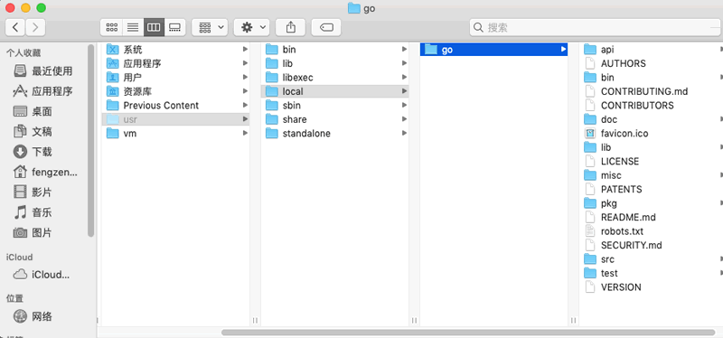

# 在MacOS平台安装

1） 安装包可以在 [golang官网](https://goland.org/dl) 下载。(如果打不开，使用 [Go语言中文网](https://studygolang.com/dl) 进行下载)


2） 根据自己情况选择下载安装包，MacOS 的Go语言开发包是 .pkg 格式的。


3） 双击下载的安装包即可开始安装，MacOS 下是傻瓜式安装，一路点击“继续”即可，不再赘述。


4） 安装包会默认安装在 /usr/local 目录下，如下所示。




5） 安装完成之后，在终端运行 go version，如果显示类似下面的信息，表明安装成功。

```shell
MyMBP:~ godfrey$ go version
go version go1.13.7 darwin/amd64
```


6） 设置 GOPATH 环境变量，在终端中运行 vi ~/.bash_profile（如果没有 .bash_profile，那就新建一个）

```shell
vi ~/.bash_profile
export GOPATH=$HOME/go
```


7） 保存然后退出你的编辑器。然后在终端中运行下面命令

```shell
source ~/.bash_profile
```


8） GOROOT 也就是 Go 开发包的安装目录默认是在 /usr/local/go，如果没有，可以在 .bash_profile 文件中设置。

```shell
vi ~/.bash_profile
export GOROOT=/usr/local/go
```

9） 查看配置信息，如果出现如下信息，则表示安装配置完成。
```shell
MyMBP:~ godfrey$ go env
GO111MODULE=""
GOARCH="amd64"
GOBIN=""
GOCACHE="/Users/godfrey/Library/Caches/go-build"
GOENV="/Users/godfrey/Library/Application Support/go/env"
GOEXE=""
GOFLAGS=""
GOHOSTARCH="amd64"
GOHOSTOS="darwin"
GONOPROXY=""
GONOSUMDB=""
GOOS="darwin"
GOPATH="/Users/godfrey/go"
...
```

