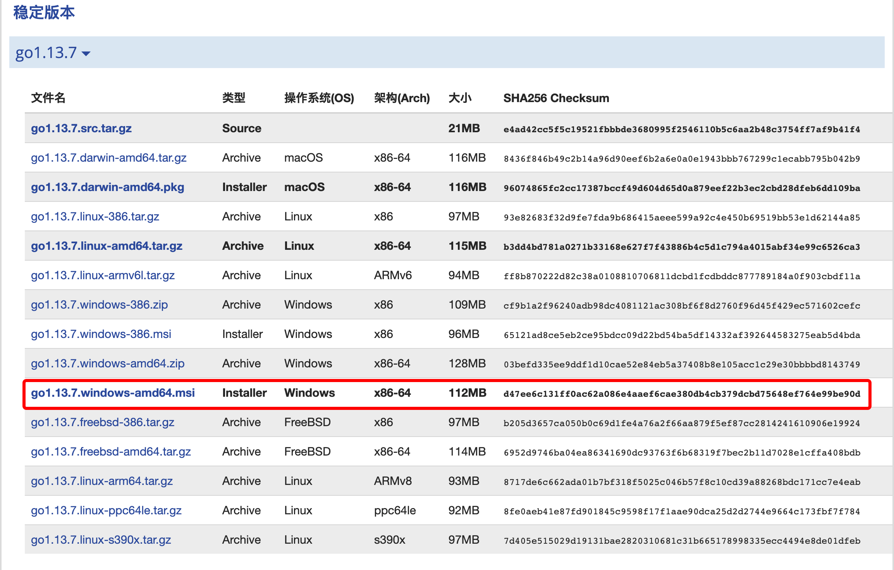
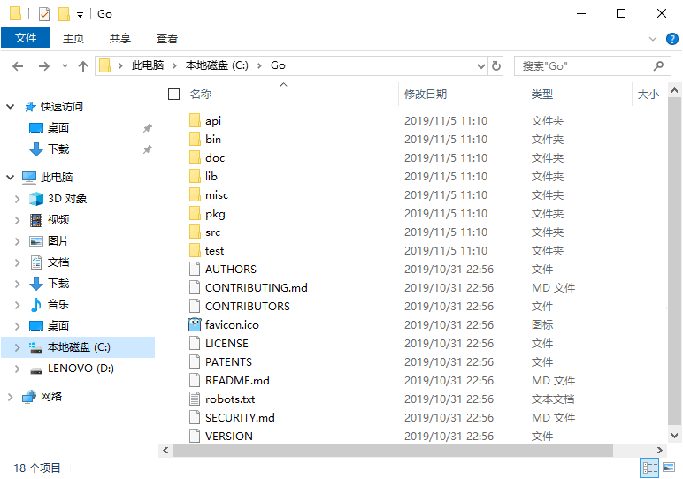
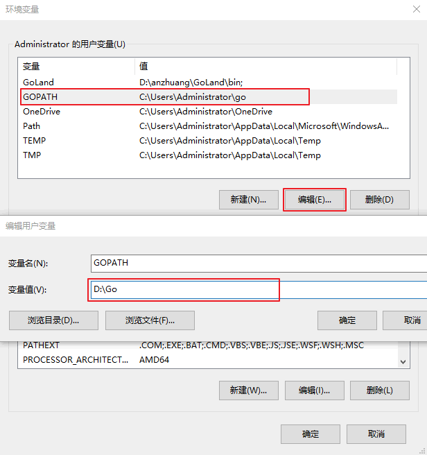
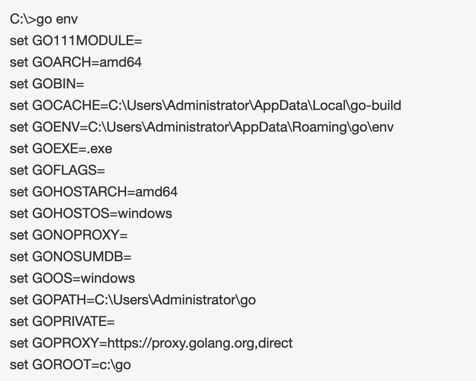

# 在Windows平台安装

1） 安装包可以在 [golang官网](https://goland.org/dl) 下载。(如果打不开，请使用 [Go语言中文网](https://studygolang.com/dl) 进行下载)

2） 这里下载的是 32&64 位的开发包，如下图所示。

3） 双击我们下载好的Go语言开发包即可启动安装程序，如下图所示，这是Go语言的用户许可协议，无需管它，直接勾选“I accept ...”，然后点击“Next”即可。

4） 在 Windows 系统下Go语言开发包会默认安装到 C 盘的 Go 目录下，推荐在这个目录下安装，使用起来较为方便。你也可以选择其他的安装目录，确认无误后点击“Next”，如下图所示：

5） Go语言开发包的安装没有其它需要设置的选项，点击“Install”即可开始安装，如下图所示：

6） 等待程序完成安装，然后点击“Finish”退出安装程序。

7） 安装完成后，在我们刚才设置的安装目录下将生成一些目录和文件，如下图所示：

8） 设置环境变量
在桌面或者资源管理器右键点击“我的电脑”（或者“此电脑”） → “属性” → “高级系统设置” → “环境变量”，如下图所示。

9） 在弹出的菜单里找到 GOPATH 对应的选项点击编辑之后就可以修改了，没有的话可以选择新建，并将变量名填写为 GOPATH，变量值设置为任意目录均可（尽量选择空目录），例如 D:\Go。

10） 环境变量设置好后，可以在命令行通过 go env 命令来进行测试。

出现类似上面的结果，说明我们的Go开发包已经安装成功了，可以开发使用了。

