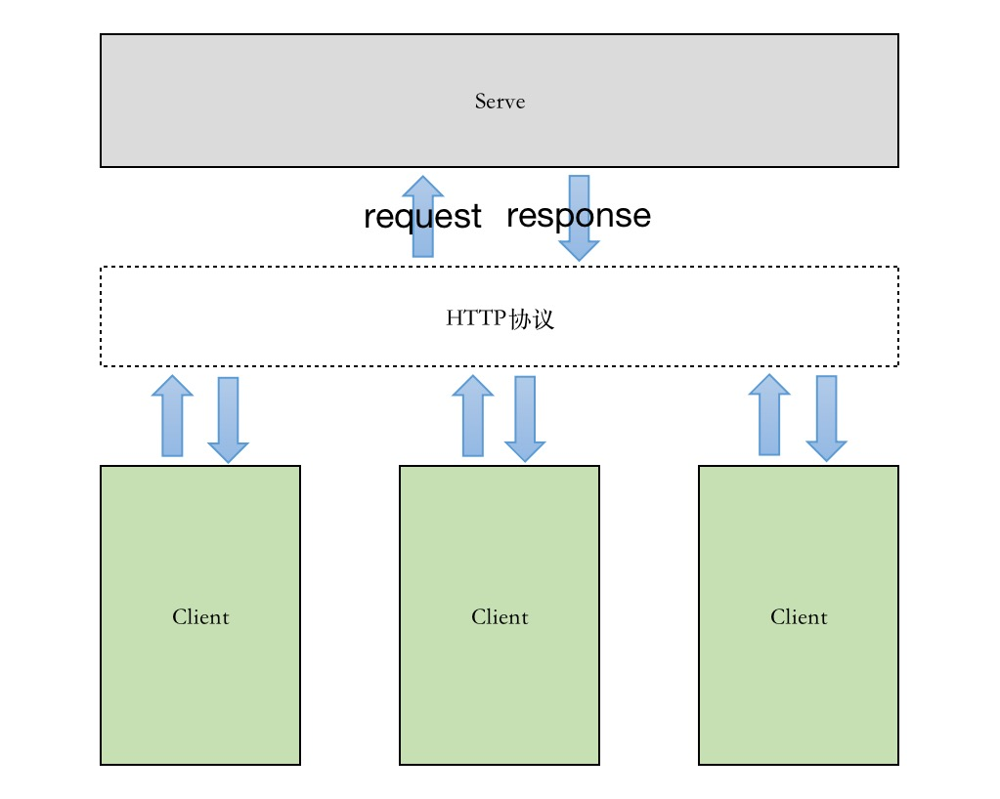

# HTTP编程

HTTP（HyperText Transfer Protocol，超文本传输协议）是应用作为广泛的一种网络协议，定义了客户端和服务器端之间请求与响应的传输标准。

Go语言标准库提供了 net/http包，涵盖了HTTP客户端和服务器端的具体实现。使用 net/http包 ，可以很轻松方便的开发HTTP客户端或服务器端的程序。



## HTTP客户端

Go语言内置的 net/http包 提供了最简洁的HTTP客户端实现，无须借助第三方网络通信库就可以直接使用GET和POST方式请求数据。

### 基本用法

net/http包的Client类型提供了如下几个常见方法，可以简单实现HTTP请求：

```text
func (c *Client) Get(url string) (r *Response, err error)
func (c *Client) Post(url string, bodyType string, body io.Reader) (r *Response, err error)
func (c *Client) PostForm(url string, data url.Values) (r *Response, err error)
func (c *Client) Head(url string) (r *Response, err error)
func (c *Client) Do(req *Request) (resp *Response, err error)
```

1）http.Get()

请求一个网络资源，只需使用 http.Get() 方法（等价于 http.DefaultClient.Get()） 即可。

示例如下：
```text
resp, err := http.Get("http://dazhairen.com")
if err != nil {
    // todo 处理错误
    return
}
defer resp.Body.close()
io.Copy(os.Stdout, resp.Body)
```


2）http.Post()

以POST方式发送数据，只需调用 http.Post() 方法并传递3个参数：请求目标的url，POST数据的资源类型，数据的byte流。

示例如下：
```text
resp, err := http.Post("http://dazhairen.com/upload", "image/png", &imageDataBuf)
if err != nil {
    // todo 处理错误
    return
}
if resp.StatusCode != http.StatusOK {
    // todo 处理错误
    return 
}
...
```

3）http.PostForm()

http.PostForm() 方法实现了标准编码格式为 application/x-www-form-urlencoded 的表单提交。

示例如下：
```text
resp, err := http.PostForm("http://dazhairen.com/post", {"username": "admin", "password": "123456"})
if err != nil {
    // todo 处理错误
    return
}
...
```

4）http.Head()

HTTP中的Head请求方式只请求目标url的头部信息，而不返回body。

示例如下：
```text
resp, err := http.Head("http://dazhairen.com")
if err != nil {
    // todo 处理错误
    return 
}
...
```


### 封装

除了基本的HTTP操作，Go语言标准库暴露了比较底层的HTTP相关库。可以让开发者基于这些库定制HTTP服务器和使用HTTP服务。

1）自定义 http.Client

上面使用的 http.Get()、http.Post()、http.PostForm()和http.Head()方法都是在http.DefaultClient的基础上进行操作的，如 http.Get() 等价于 http.DefaultClient.Get()，其它同理。
说明，存在默认的Client，也就是说 可以自定义 Client。

Go语言标准库中，http.Client类型包含了3个公共数据成员：Transport RoundTripper、CheckRedirect func(req *Request, via []*Request) error、Jar CookieJar。

    Transport表示HTTP事务，用来处理客户端的请求并等待服务端的响应

    CheckRedirect，用于指定处理重定向的策略

    Jar，指定cookie的jar


2）自定义 http.Transport

Transport 实现了 RoundTripper接口 ，而 RoundTripper 接口只有一个方法 RoundTrip()，所以 Transport 的入口函数就是 RoundTrip()。
Transport 的主要用功能是缓存长连接，用于大量http请求场景的连接复用，减少发送请求时TCP连接建立的时间损耗。此外，Transport 还能对连接作一些限制，比如说连接超时时间，每个机器的最大连接数，等等。

Transport 包含如下几个概念：

- 连接池：在 idleConn 中保存了不同类型的请求连接。当发生请求时，首先会尝试从连接池中取一条符合其请求类型的连接使用

- readLoop/writeLoop：连接之上的功能，循环处理该类型的请求（发送request，返回response）

- roundTrip：请求的真正入口，接收到一个请求后会交给readLoop和writeLoop处理

!!! note ""
    一对 readLoop/writeLoop 只能处理一条连接，如果这条连接上没有更多的请求，则关闭连接，退出循环，释放资源。


## HTTP服务器端

1）处理HTTP请求

使用 net/http包 提供的 http.ListenAndServe() 方法，可以对指定的地址进行监听。在服务器端开启一个HTTP方法的原型如下：
```text
func Listen(addr string, handler Handler) error
```

addr，所要监听的TCP网络地址；
handler，服务器端处理程序。可能为空，为空的情况下，服务器端会调用 http.DefaultServeMux 进行处理，而服务器端编写的业务逻辑处理程序 http.Handle() 或 http.HandleFunc() 默认注入到 http.DefaultServeMux 中。

```text
http.Handle("/foo", fooHandle)
http.HandleFunc("/bar", func(w http.ResponseWrite, r *http.Request) {
    fmt.Fprintf(w, "Hello, %q", html.EscapeString(r.URL.Path))
})
log.Fatal(http.ListenAndServe(":8080", nil))
```


2）处理HTTPS请求

对应的，net/http包 还提供了 http.ListenAndServeTLS()方法，用于处理HTTPS连接请求。
```text
func ListenAndServeTLS(addr string, certFile string, keyFile string, handler Handler) error
```

ListenAndServeTLS() 和 ListenAndServe() 行为基本一致。区别在于 ListenAndServe() 只处理HTTP请求，而ListenAndServeTLS() 只处理HTTPS请求。
此外，服务器上必须有证书和与证书配套的私钥文件。certFile对应SSL证书文件的存放路径，keyFile对应证书私钥文件路径。

```text
http.Handle("/foo", fooHandler)
http.HandleFunc("/bar", func(w http.ResponseWriter, r *http.Request) {
    fmt.Fprintf(w, "Hello, %q", html.EscapeString(r.URL.Path))
})
log.Fatal(http.ListenAndServeTLS(":8080", "cert.pem", "key.pem", nil))
```

