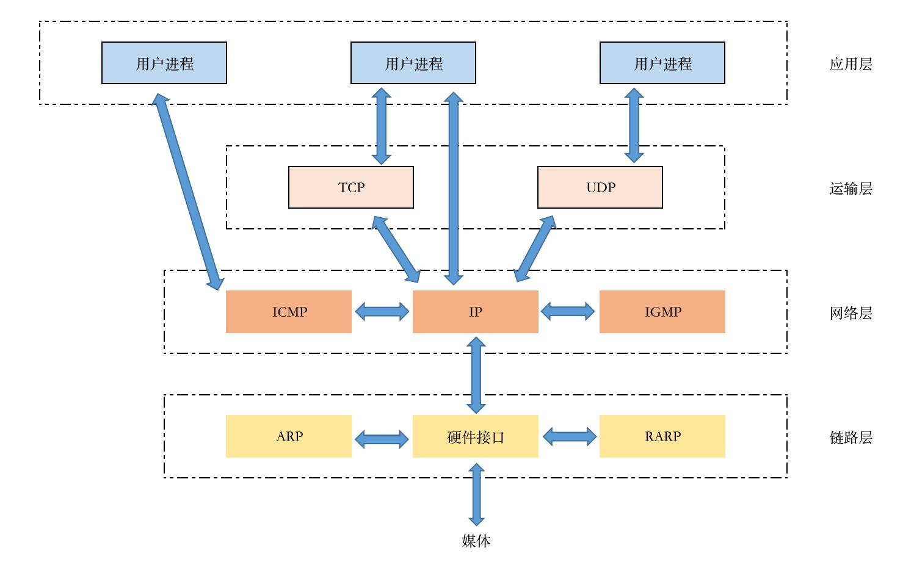
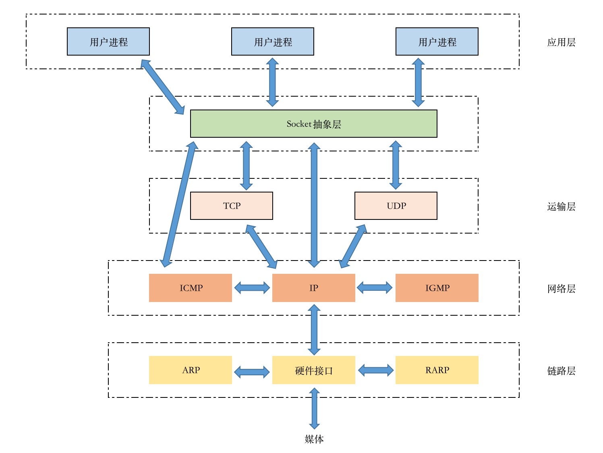

# Socket编程

对于底层网络开发者来说，几乎所有网络编程都是Socket，大部分网络的编程都离不开Socket。如HTTP编程、Web开发、IM通信、视频流传输的底层都是Socket编程。

Socket起源于UNIX，而UNIX的基本思想是 "一切皆文件" ，也就是说，一切都可以使用 "打开-读写-关闭" 等模式来操作。Socket就是这种模式实现的。

## Socket通信

网络中的进程间通过Socket通信，首先要唯一标识一个进程。在本地，可以通过进程 PID 来唯一标识一个进程。但是在网络中是行不通的。
TCP/IP协议族可以解决这个问题，网络层的 "IP地址" 可以唯一标识网络中的主机，而传输层的 "协议+端口" 可以唯一标识主机中的应用程序（或者说进程）。
综上，标识网络进程的三大要素是：IP地址、协议、端口，而网络通信就是利用这个标识进行交互。

TCP/IP协议族:

Socket存在于TCP/IP协议族中的抽象层：

