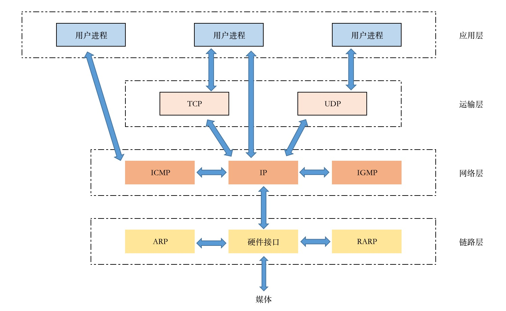
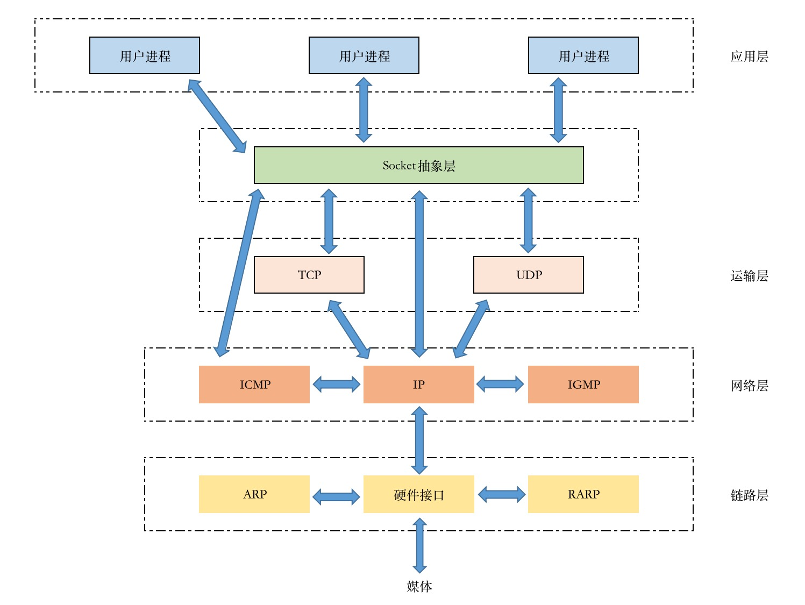

# Socket编程

对于底层网络开发者来说，几乎所有网络编程都是Socket，大部分网络的编程都离不开Socket。如HTTP编程、Web开发、IM通信、视频流传输的底层都是Socket编程。

Socket起源于UNIX，而UNIX的基本思想是 "一切皆文件" ，也就是说，一切都可以使用 "打开-读写-关闭" 等模式来操作。Socket就是这种模式实现的。


## Socket通信

网络中的进程间通过Socket通信，首先要唯一标识一个进程。在本地，可以通过进程 PID 来唯一标识一个进程。但是在网络中是行不通的。
TCP/IP协议族可以解决这个问题，网络层的 "IP地址" 可以唯一标识网络中的主机，而传输层的 "协议+端口" 可以唯一标识主机中的应用程序（或者说进程）。
综上，标识网络进程的三大要素是：IP地址、协议、端口，而网络通信就是利用这个标识进行交互。

TCP/IP协议族:



Socket存在于TCP/IP协议族中的抽象层：




## Go语言支持的IP类型

Go语言中的 net包 提供了很多类型、函数和方法用于网络编程。

IP定义方式：`type IP []byte`

ParseIP(s string)IP，把IPv4或者IPv6的地址转化为IP类型。

示例：
```go
package main

import (
	"fmt"
	"net"
	"os"
)

func main() {
	str := "127.0.0.1"
	addr := net.ParseIP(str)
	if addr == nil {
		fmt.Println("无效的IP地址")
	} else {
		fmt.Println("IP的地址是", addr.String())
		fmt.Println("IP的mask是", addr.DefaultMask())
	}
	os.Exit(0)
}
```

