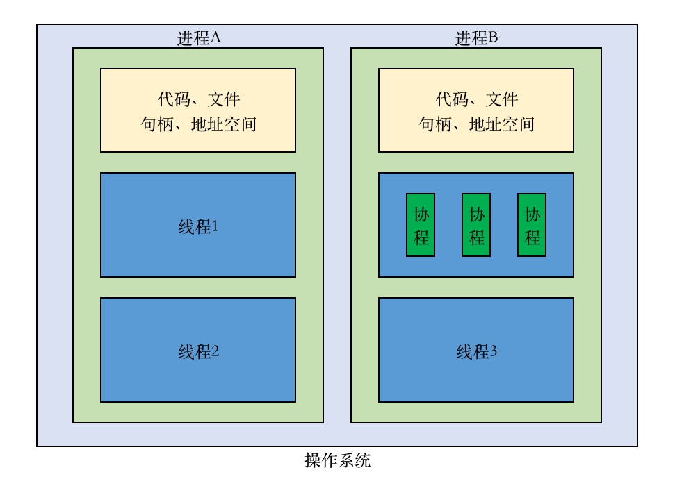
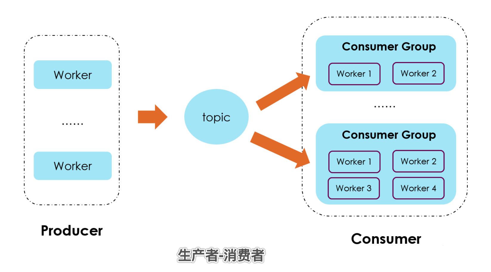
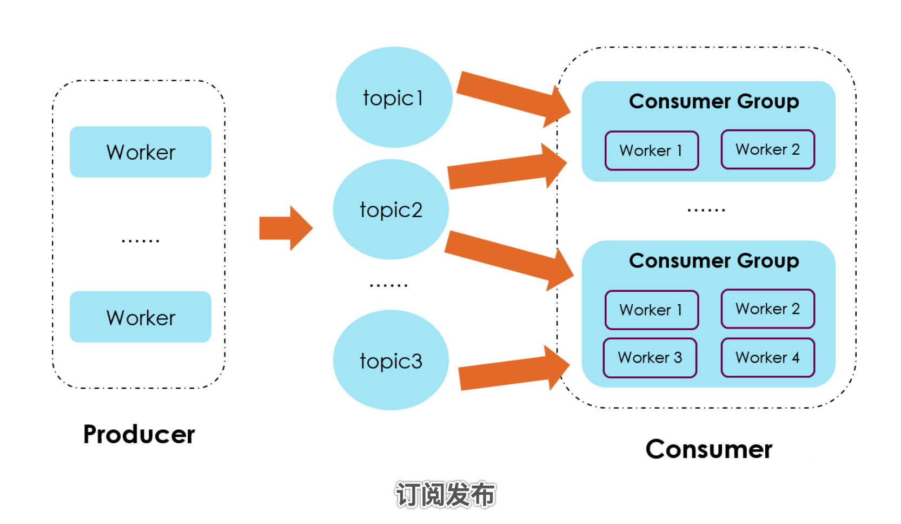

# 并发、事件驱动

## 同步、异步

关注消息通知机制，一次完成是同步，分批次完成是异步

- 同步: 当程序A调用程序B时，程序A停止不往下执行，直到程序B执行完成，程序A才继续执行下去

- 异步: 当程序A调用程序B时，不管程序B，程序A继续往下执行，不受程序B的影响

举个例子，小张"打电话"向领导"请假"，这是同步。小张"发短信"向领导"请假"，这是异步。

## 阻塞、非阻塞

关注程序在等待调用结果（消息，返回值）时的状态

- 阻塞: 调用结果返回前，程序被挂起。得到结果后，才能继续执行下去

- 非阻塞: 在不能立刻得到结果之前，程序不会阻塞当前线程，而是继续执行下去

阻塞是使用同步机制的结果，非阻塞则是使用异步机制的结果。

举个例子，小王去买一份炒饭，点好单后，等着饭店老板炒好饭（可能要15分钟，也可能要半小时），期间什么事情都不做，这是阻塞。 小王点好单后，告诉饭店老板一会再来拿，这时小王先去超市买点零食饮料，这是非阻塞。

## 同步异步和阻塞非阻塞的组合

同步、异步，与阻塞、非阻塞，没有必然联系

- 同步阻塞: 当进程调用某些涉及I/O操作的系统调用或者库函数时，进程便暂停下来，等待I/O操作完成后再继续运行。

- 同步非阻塞: 不会等待数据就绪，而是结合反复轮询来尝试数据是否就绪。与同步阻塞I/O相比，同步非阻塞I/O好处就是在一个进程中可以同时处理多个I/O操作，而不是阻塞在一个I/O操作上。

- 异步阻塞: 如上面例子中的发短信请假，在收到领导短信回复之前什么事都做不了（如不能跑去旅游）。

- 异步非阻塞: 同样是发短信请假，不管领导同不同意，我都直接去旅游，不去关心结果（霸王假）。

## 单线程、多线程

- 单线程: 小王一个人出门先去饭店买饭，买好饭之后再去超市买零食，最后去水果店买水果。整个链条一个人依次执行。

- 多线程: 小王叫上室友一起出门，小王去饭店买饭，室友A去超市买零食，室友B去水果店店买水果。整个链条分配给3个人执行。

## 进程、线程、协程

进程：当运行一个应用程序的时候，系统会为这个应用程序启动一个进程，可以将这个进程看作包含了应用程序在运行中需要用到和维护的各种资源容器。一个进程是一个执行空间，这个空间被系统调度用来执行函数中的代码。

线程：线程从属于进程，是程序的实际执行者。一个进程至少包含一个主线程，也可以有更多的子线程。

协程：相当于微线程，协程执行效率极高，因为子程序function内切换不是线程切换，而是由程序自身控制，因此，没有线程切换的开销，和多线程比，线程数量越多，协程的性能优势就越明显

关系图：

效率（即切换开销谁最小）比较：协程 > 多线程 > 多进程

编程难度比较: 协程 > 多进程 > 多线程。因为多线程要注意同步和互斥（线程安全），否则容易造成死锁。

## 并发、并行、多任务

- 并发: 逻辑上的同时运行，但同一时间底层可能只有一个任务在运行

- 并行: 真正的同时运行，通过多核实现，任务分布在不同核上，也可以是分布在不同服务器上

- 多任务: 只要逻辑上能运行多个程序，就可以算作是多任务，不管是不是并行

底层实现了异步，上层就会有并行的可能，不然程序最多只是并发

## 事件驱动、观察者、生产者消费者、订阅发布、服务发现

下面几个术语，其实原理都差不多，都是一种主动式的操作，只是出现的早晚时间不同。

- 事件驱动: 是一种宏观的模式，等待消息做事，就是事件驱动。观察者、生产者消费者、订阅发布、服务发现都只是事件驱动的具体实现模型。

	??? note "网友讲解"
		现下流行的异步server都是基于事件驱动的（如nginx）。事件驱动简化了编程模型，很好地解决了多线程难于编程，难于调试的问题。异步事件驱动模型中，把会导致阻塞的操作转化为一个异步操作，主线程负责发起这个异步操作，并处理这个异步操作的结果。由于所有阻塞的操作都转化为异步操作，理论上主线程的大部分时间都是在处理实际的计算任务，少了多线程的调度时间，所以这种模型的性能通常会比较好。

- 观察者模式: 有时又被称为模型（Model）-视图（View）模式、源-收听者(Listener)模式或从属者模式，在这种模式中，一个目标物件管理所有相依于它的观察者物件，并且在它本身的状态改变时主动发出通知。这通常透过呼叫各观察者所提供的方法来实现。

- 生产消费者模式: 指的是由生产者将数据源源不断推送到消息中心，由不同的消费者从消息中心取出数据做自己的处理，在同一类别下，所有消费者拿到的都是同样的数据

- 订阅发布模式: 本质上也是一种生产消费者模式，不同的是，由订阅者首先向消息中心指定自己对哪些数据感兴趣，发布者推送的数据经过消息中心后，每个订阅者拿到的仅仅是自己感兴趣的一组数据。

- 服务注册与发现: 微服务架构由一个服务注册中心和围绕该注册中心的一堆服务组成。每个服务将自己的地址和其他元信息注册到注册中心（zookeeper或etcd等），有依赖它的其他服务会实时发现（watch机制）变化。

生产消费者模式和订阅发布模式是使用消息中间件时最常用的，用于功能解耦和分布式系统间的消息通信。

生产消费图示：

订阅发布图示：

